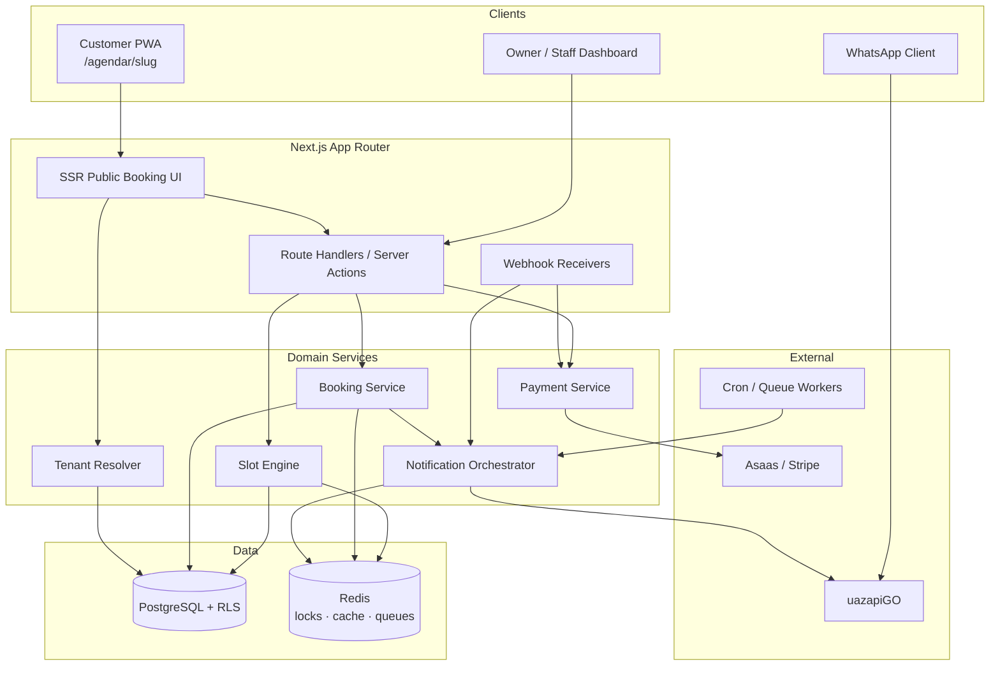
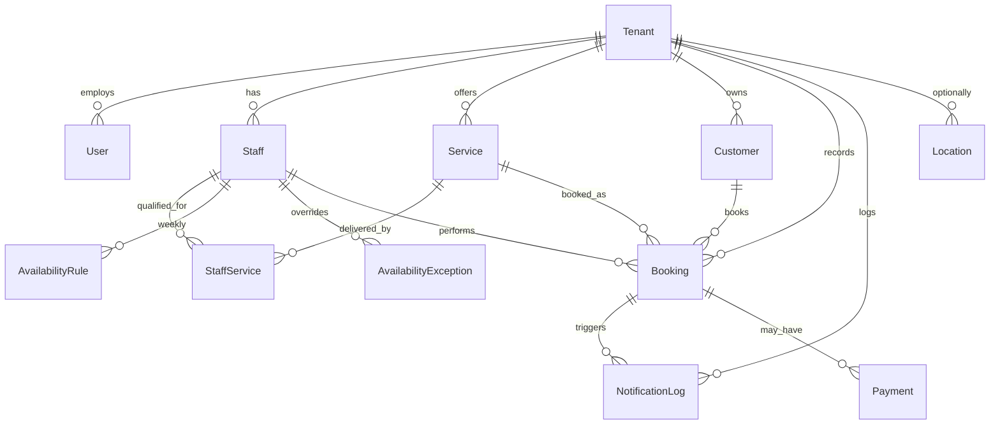
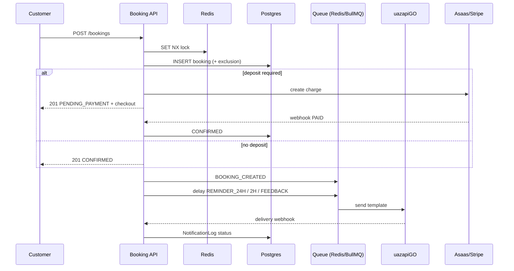
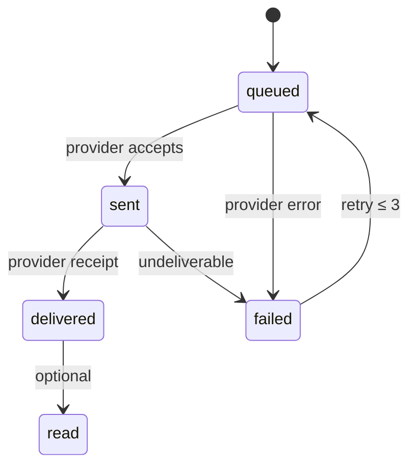

# 02 — System Architecture & Database Schema

**Product:** Trato — multi-tenant Booking SaaS (Barber / Beauty vertical)  
**Audience:** Engineering, Product, Infra  
**Basis:** Reverse-engineering signals from BarberPro (`/agendar/[slug]`, tenant SEO SSR, WhatsApp reminder claims, service catalog) + competitive gaps for a modern B2B2C platform  
**Stack:** Next.js App Router · TypeScript · Tailwind · Shadcn/UI · RHF + Zod · PostgreSQL (Prisma / Supabase) · Redis · uazapiGO · Asaas / Stripe  

---

## 1. High-Level Architecture

### 1.1 Context diagram



### 1.2 Multi-tenancy strategy

| Concern | Decision |
|---|---|
| Isolation key | `tenant_id` UUID on every business row |
| Public routing | `/agendar/[slug]` → resolve `Tenant.slug` (unique, indexed) |
| Auth tenants | Supabase Auth / JWT with `app_metadata.tenant_id` + `role` |
| DB enforcement | PostgreSQL **RLS** policies on `tenant_id` (defense in depth beyond app filters) |
| Cross-tenant admin | Platform `SUPER_ADMIN` role bypasses RLS via `SET LOCAL` / security definer functions only |
| Caching | Redis keys prefixed `t:{tenantId}:…` |
| Slot locks | Redis `SET NX EX` on `t:{tenantId}:lock:staff:{staffId}:{startIso}` |

**Tenant resolution order (public):**

1. Path slug (`dom-carlos-barbearia`)
2. Optional custom domain → `Tenant.custom_domain`
3. Fail closed → 404 (never leak other tenants)

---

## 2. Domain Model Overview



---

## 3. Complete Prisma Schema

> Store all instants as `Timestamptz` (UTC). Convert to `Tenant.timezone` (IANA, e.g. `America/Sao_Paulo`) only at the edges (UI, WhatsApp copy, slot labeling).

```prisma
// prisma/schema.prisma
generator client {
  provider        = "prisma-client-js"
  previewFeatures = ["postgresqlExtensions"]
}

datasource db {
  provider   = "postgresql"
  url        = env("DATABASE_URL")
  extensions = [pgcrypto, citext]
}

enum UserRole {
  SUPER_ADMIN
  OWNER
  MANAGER
  STAFF
  RECEPTION
}

enum BookingStatus {
  PENDING_PAYMENT
  CONFIRMED
  CHECKED_IN
  COMPLETED
  CANCELLED
  NO_SHOW
  EXPIRED
}

enum PaymentStatus {
  NONE
  PENDING
  PAID
  REFUNDED
  FAILED
}

enum PaymentProvider {
  NONE
  ASAAS
  STRIPE
  PIX_MANUAL
}

enum NotificationChannel {
  WHATSAPP
  SMS
  EMAIL
  PUSH
}

enum NotificationEvent {
  BOOKING_CREATED
  BOOKING_CONFIRMED
  BOOKING_CANCELLED
  BOOKING_RESCHEDULED
  REMINDER_24H
  REMINDER_2H
  FEEDBACK_POST_SERVICE
  PAYMENT_REQUIRED
  PAYMENT_RECEIVED
}

enum DayOfWeek {
  MON
  TUE
  WED
  THU
  FRI
  SAT
  SUN
}

enum StaffStatus {
  ACTIVE
  INACTIVE
  ON_LEAVE
}

model Tenant {
  id              String   @id @default(dbgenerated("gen_random_uuid()")) @db.Uuid
  slug            String   @unique @db.Citext
  name            String
  legalName       String?  @map("legal_name")
  timezone        String   @default("America/Sao_Paulo") // IANA
  locale          String   @default("pt-BR")
  currency        String   @default("BRL") @db.Char(3)
  phone           String?
  whatsappE164    String?  @map("whatsapp_e164")
  email           String?
  addressLine1    String?  @map("address_line1")
  addressLine2    String?  @map("address_line2")
  city            String?
  state           String?  @db.VarChar(2)
  postalCode      String?  @map("postal_code")
  country         String   @default("BR") @db.Char(2)
  logoUrl         String?  @map("logo_url")
  brandPrimary    String?  @map("brand_primary") // hex
  customDomain    String?  @unique @map("custom_domain")
  slotIntervalMin Int      @default(15) @map("slot_interval_min") // grid step
  bufferBeforeMin Int      @default(0) @map("buffer_before_min")
  bufferAfterMin  Int      @default(0) @map("buffer_after_min")
  minLeadMin      Int      @default(60) @map("min_lead_min") // book at least N min ahead
  maxAdvanceDays  Int      @default(60) @map("max_advance_days")
  cancelPolicyMin Int      @default(120) @map("cancel_policy_min")
  depositRequired Boolean  @default(false) @map("deposit_required")
  depositPercent  Int?     @map("deposit_percent") // 0-100
  depositFixedCents Int?   @map("deposit_fixed_cents")
  paymentProvider PaymentProvider @default(NONE) @map("payment_provider")
  asaasApiKeyEnc  String?  @map("asaas_api_key_enc")
  stripeAcctId    String?  @map("stripe_acct_id")
  waInstanceId    String?  @map("wa_instance_id") // uazapiGO instance token
  waProvider      String?  @map("wa_provider") // uazapi
  isActive        Boolean  @default(true) @map("is_active")
  plan            String   @default("starter")
  createdAt       DateTime @default(now()) @map("created_at") @db.Timestamptz(6)
  updatedAt       DateTime @updatedAt @map("updated_at") @db.Timestamptz(6)

  users             User[]
  staff             Staff[]
  services          Service[]
  customers         Customer[]
  bookings          Booking[]
  notificationLogs  NotificationLog[]
  locations         Location[]
  payments          Payment[]

  @@map("tenants")
}

model Location {
  id        String  @id @default(dbgenerated("gen_random_uuid()")) @db.Uuid
  tenantId  String  @map("tenant_id") @db.Uuid
  name      String
  address   String?
  isDefault Boolean @default(false) @map("is_default")
  timezone  String? // override tenant tz if multi-city
  createdAt DateTime @default(now()) @map("created_at") @db.Timestamptz(6)

  tenant Tenant @relation(fields: [tenantId], references: [id], onDelete: Cascade)
  staff  Staff[]

  @@index([tenantId])
  @@map("locations")
}

model User {
  id           String   @id @default(dbgenerated("gen_random_uuid()")) @db.Uuid
  tenantId     String   @map("tenant_id") @db.Uuid
  authUserId   String?  @unique @map("auth_user_id") // Supabase auth.users.id
  email        String   @db.Citext
  name         String
  phone        String?
  role         UserRole @default(STAFF)
  isActive     Boolean  @default(true) @map("is_active")
  lastLoginAt  DateTime? @map("last_login_at") @db.Timestamptz(6)
  createdAt    DateTime @default(now()) @map("created_at") @db.Timestamptz(6)
  updatedAt    DateTime @updatedAt @map("updated_at") @db.Timestamptz(6)

  tenant Tenant @relation(fields: [tenantId], references: [id], onDelete: Cascade)
  staff  Staff?

  @@unique([tenantId, email])
  @@index([tenantId])
  @@map("users")
}

model Staff {
  id            String      @id @default(dbgenerated("gen_random_uuid()")) @db.Uuid
  tenantId      String      @map("tenant_id") @db.Uuid
  userId        String?     @unique @map("user_id") @db.Uuid
  locationId    String?     @map("location_id") @db.Uuid
  displayName   String      @map("display_name")
  bio           String?
  avatarUrl     String?     @map("avatar_url")
  color         String?     // calendar color
  status        StaffStatus @default(ACTIVE)
  sortOrder     Int         @default(0) @map("sort_order")
  slotIntervalMin Int?      @map("slot_interval_min") // override tenant default
  bufferBeforeMin Int?      @map("buffer_before_min")
  bufferAfterMin  Int?      @map("buffer_after_min")
  createdAt     DateTime    @default(now()) @map("created_at") @db.Timestamptz(6)
  updatedAt     DateTime    @updatedAt @map("updated_at") @db.Timestamptz(6)

  tenant       Tenant                 @relation(fields: [tenantId], references: [id], onDelete: Cascade)
  user         User?                  @relation(fields: [userId], references: [id], onDelete: SetNull)
  location     Location?              @relation(fields: [locationId], references: [id], onDelete: SetNull)
  services     StaffService[]
  rules        AvailabilityRule[]
  exceptions   AvailabilityException[]
  bookings     Booking[]

  @@index([tenantId, status])
  @@map("staff")
}

model Service {
  id              String   @id @default(dbgenerated("gen_random_uuid()")) @db.Uuid
  tenantId        String   @map("tenant_id") @db.Uuid
  name            String
  description     String?
  durationMin     Int      @map("duration_min") // pure service time
  bufferAfterMin  Int      @default(0) @map("buffer_after_min") // cleanup / turnaround
  priceCents      Int      @map("price_cents")
  currency        String   @default("BRL") @db.Char(3)
  category        String?
  isActive        Boolean  @default(true) @map("is_active")
  requiresDeposit Boolean  @default(false) @map("requires_deposit")
  sortOrder       Int      @default(0) @map("sort_order")
  createdAt       DateTime @default(now()) @map("created_at") @db.Timestamptz(6)
  updatedAt       DateTime @updatedAt @map("updated_at") @db.Timestamptz(6)

  tenant   Tenant         @relation(fields: [tenantId], references: [id], onDelete: Cascade)
  staff    StaffService[]
  bookings Booking[]

  @@index([tenantId, isActive])
  @@map("services")
}

model StaffService {
  staffId   String @map("staff_id") @db.Uuid
  serviceId String @map("service_id") @db.Uuid
  tenantId  String @map("tenant_id") @db.Uuid // denormalized for RLS

  staff   Staff   @relation(fields: [staffId], references: [id], onDelete: Cascade)
  service Service @relation(fields: [serviceId], references: [id], onDelete: Cascade)

  @@id([staffId, serviceId])
  @@index([tenantId])
  @@map("staff_services")
}

/// Weekly recurring working hours (local wall-clock in tenant/staff timezone)
model AvailabilityRule {
  id          String    @id @default(dbgenerated("gen_random_uuid()")) @db.Uuid
  tenantId    String    @map("tenant_id") @db.Uuid
  staffId     String    @map("staff_id") @db.Uuid
  dayOfWeek   DayOfWeek @map("day_of_week")
  startTime   String    @map("start_time") // "09:00" local
  endTime     String    @map("end_time")   // "18:00" local
  breakStart  String?   @map("break_start") // optional lunch
  breakEnd    String?   @map("break_end")
  isActive    Boolean   @default(true) @map("is_active")
  effectiveFrom DateTime? @map("effective_from") @db.Date
  effectiveTo   DateTime? @map("effective_to") @db.Date

  staff Staff @relation(fields: [staffId], references: [id], onDelete: Cascade)

  @@index([tenantId, staffId, dayOfWeek])
  @@map("availability_rules")
}

/// One-off overrides: day off, custom hours, vacation
model AvailabilityException {
  id          String   @id @default(dbgenerated("gen_random_uuid()")) @db.Uuid
  tenantId    String   @map("tenant_id") @db.Uuid
  staffId     String   @map("staff_id") @db.Uuid
  date        DateTime @db.Date // calendar date in staff timezone
  isDayOff    Boolean  @default(false) @map("is_day_off")
  startTime   String?  @map("start_time")
  endTime     String?  @map("end_time")
  reason      String?
  createdAt   DateTime @default(now()) @map("created_at") @db.Timestamptz(6)

  staff Staff @relation(fields: [staffId], references: [id], onDelete: Cascade)

  @@unique([staffId, date])
  @@index([tenantId, staffId, date])
  @@map("availability_exceptions")
}

model Customer {
  id           String   @id @default(dbgenerated("gen_random_uuid()")) @db.Uuid
  tenantId     String   @map("tenant_id") @db.Uuid
  name         String
  phoneE164    String   @map("phone_e164") // +5533...
  email        String?  @db.Citext
  notes        String?
  marketingOptIn Boolean @default(true) @map("marketing_opt_in")
  createdAt    DateTime @default(now()) @map("created_at") @db.Timestamptz(6)
  updatedAt    DateTime @updatedAt @map("updated_at") @db.Timestamptz(6)

  tenant   Tenant    @relation(fields: [tenantId], references: [id], onDelete: Cascade)
  bookings Booking[]

  @@unique([tenantId, phoneE164])
  @@index([tenantId, name])
  @@map("customers")
}

model Booking {
  id              String        @id @default(dbgenerated("gen_random_uuid()")) @db.Uuid
  tenantId        String        @map("tenant_id") @db.Uuid
  customerId      String        @map("customer_id") @db.Uuid
  staffId         String        @map("staff_id") @db.Uuid
  serviceId       String        @map("service_id") @db.Uuid
  status          BookingStatus @default(CONFIRMED)
  /// Inclusive start of service (UTC)
  startsAt        DateTime      @map("starts_at") @db.Timestamptz(6)
  /// Exclusive end = startsAt + durationMin (UTC)
  endsAt          DateTime      @map("ends_at") @db.Timestamptz(6)
  /// Blocked window including buffers (for overlap checks)
  blockStartsAt   DateTime      @map("block_starts_at") @db.Timestamptz(6)
  blockEndsAt     DateTime      @map("block_ends_at") @db.Timestamptz(6)
  timezone        String        // snapshot of tenant/staff tz at booking time
  priceCents      Int           @map("price_cents")
  currency        String        @default("BRL") @db.Char(3)
  paymentStatus   PaymentStatus @default(NONE) @map("payment_status")
  notes           String?
  source          String        @default("public_web") // public_web | dashboard | whatsapp
  cancellationReason String?    @map("cancellation_reason")
  cancelledAt     DateTime?     @map("cancelled_at") @db.Timestamptz(6)
  completedAt     DateTime?     @map("completed_at") @db.Timestamptz(6)
  idempotencyKey  String?       @unique @map("idempotency_key")
  createdAt       DateTime      @default(now()) @map("created_at") @db.Timestamptz(6)
  updatedAt       DateTime      @updatedAt @map("updated_at") @db.Timestamptz(6)

  tenant       Tenant            @relation(fields: [tenantId], references: [id], onDelete: Cascade)
  customer     Customer          @relation(fields: [customerId], references: [id], onDelete: Restrict)
  staff        Staff             @relation(fields: [staffId], references: [id], onDelete: Restrict)
  service      Service           @relation(fields: [serviceId], references: [id], onDelete: Restrict)
  notifications NotificationLog[]
  payments     Payment[]

  /// Prevent double-book on same staff for overlapping active blocks
  @@index([tenantId, staffId, blockStartsAt, blockEndsAt])
  @@index([tenantId, startsAt])
  @@index([tenantId, customerId])
  @@index([tenantId, status])
  @@map("bookings")
}

model Payment {
  id              String          @id @default(dbgenerated("gen_random_uuid()")) @db.Uuid
  tenantId        String          @map("tenant_id") @db.Uuid
  bookingId       String          @map("booking_id") @db.Uuid
  provider        PaymentProvider
  providerRef     String?         @map("provider_ref")
  amountCents     Int             @map("amount_cents")
  currency        String          @default("BRL") @db.Char(3)
  status          PaymentStatus   @default(PENDING)
  checkoutUrl     String?         @map("checkout_url")
  pixQrCode       String?         @map("pix_qr_code")
  rawPayload      Json?           @map("raw_payload")
  paidAt          DateTime?       @map("paid_at") @db.Timestamptz(6)
  createdAt       DateTime        @default(now()) @map("created_at") @db.Timestamptz(6)
  updatedAt       DateTime        @updatedAt @map("updated_at") @db.Timestamptz(6)

  tenant  Tenant  @relation(fields: [tenantId], references: [id], onDelete: Cascade)
  booking Booking @relation(fields: [bookingId], references: [id], onDelete: Cascade)

  @@index([tenantId, bookingId])
  @@index([providerRef])
  @@map("payments")
}

model NotificationLog {
  id            String              @id @default(dbgenerated("gen_random_uuid()")) @db.Uuid
  tenantId      String              @map("tenant_id") @db.Uuid
  bookingId     String?             @map("booking_id") @db.Uuid
  customerId    String?             @map("customer_id") @db.Uuid
  channel       NotificationChannel @default(WHATSAPP)
  event         NotificationEvent
  toE164        String              @map("to_e164")
  templateKey   String              @map("template_key")
  payload       Json
  providerMsgId String?             @map("provider_msg_id")
  status        String              @default("queued") // queued|sent|delivered|failed|read
  error         String?
  scheduledFor  DateTime?           @map("scheduled_for") @db.Timestamptz(6)
  sentAt        DateTime?           @map("sent_at") @db.Timestamptz(6)
  createdAt     DateTime            @default(now()) @map("created_at") @db.Timestamptz(6)

  tenant  Tenant   @relation(fields: [tenantId], references: [id], onDelete: Cascade)
  booking Booking? @relation(fields: [bookingId], references: [id], onDelete: SetNull)

  @@index([tenantId, event, status])
  @@index([scheduledFor, status])
  @@index([bookingId, event])
  @@map("notification_logs")
}
```

### 3.1 Exclusion constraint (SQL DDL add-on)

Prisma cannot express GiST exclusion constraints; apply via migration SQL to hard-block overlaps:

```sql
-- Requires: CREATE EXTENSION IF NOT EXISTS btree_gist;

ALTER TABLE bookings
  ADD CONSTRAINT bookings_no_overlap
  EXCLUDE USING gist (
    staff_id WITH =,
    tstzrange(block_starts_at, block_ends_at, '[)') WITH &&
  )
  WHERE (status IN ('PENDING_PAYMENT', 'CONFIRMED', 'CHECKED_IN'));
```

### 3.2 RLS sketch (Supabase)

```sql
ALTER TABLE bookings ENABLE ROW LEVEL SECURITY;

CREATE POLICY bookings_tenant_isolation ON bookings
  USING (tenant_id = (auth.jwt() -> 'app_metadata' ->> 'tenant_id')::uuid)
  WITH CHECK (tenant_id = (auth.jwt() -> 'app_metadata' ->> 'tenant_id')::uuid);

-- Public booking reads use a SECURITY DEFINER function scoped by slug,
-- never a broad anon SELECT on bookings.
```

---

## 4. Timezone & Slot Semantics

| Concept | Rule |
|---|---|
| Storage | All `DateTime` fields UTC (`Timestamptz`) |
| Business calendar | `Tenant.timezone` (IANA) |
| Working hours | Stored as local `HH:mm` strings on `AvailabilityRule` |
| Slot grid | `interval = staff.slotIntervalMin ?? tenant.slotIntervalMin` (default 15) |
| Service block | `durationMin + service.bufferAfterMin + staff/tenant buffers` |
| Overlap test | Half-open ranges `[blockStartsAt, blockEndsAt)` |
| Lead time | Reject slots where `startsAt < now() + minLeadMin` |
| Horizon | Reject dates beyond `now + maxAdvanceDays` in tenant TZ |

**Effective duration formula:**

```
serviceBlockMin = service.durationMin
                  + service.bufferAfterMin
                  + (staff.bufferBeforeMin ?? tenant.bufferBeforeMin)
                  + (staff.bufferAfterMin  ?? tenant.bufferAfterMin)

blockStartsAt = startsAt - bufferBefore
blockEndsAt   = startsAt + service.durationMin + bufferAfter(+service)
endsAt        = startsAt + service.durationMin   // customer-facing end
```

---

## 5. Slot Availability Algorithm

### 5.1 TypeScript reference implementation

```typescript
import { DateTime, Interval } from 'luxon';

type DayOfWeek = 'MON' | 'TUE' | 'WED' | 'THU' | 'FRI' | 'SAT' | 'SUN';

interface AvailabilityRule {
  dayOfWeek: DayOfWeek;
  startTime: string; // "09:00"
  endTime: string;
  breakStart?: string | null;
  breakEnd?: string | null;
  isActive: boolean;
}

interface AvailabilityException {
  date: string; // "2026-09-04"
  isDayOff: boolean;
  startTime?: string | null;
  endTime?: string | null;
}

interface ExistingBooking {
  blockStartsAt: Date; // UTC
  blockEndsAt: Date;
  status: string;
}

interface SlotInput {
  dateLocal: string;          // "2026-09-04" in tenant TZ
  timezone: string;           // "America/Sao_Paulo"
  staffId: string;
  serviceDurationMin: number;
  serviceBufferAfterMin: number;
  bufferBeforeMin: number;
  bufferAfterMin: number;
  slotIntervalMin: number;
  minLeadMin: number;
  rules: AvailabilityRule[];
  exceptions: AvailabilityException[];
  bookings: ExistingBooking[];
  now?: Date;
}

interface Slot {
  startsAt: string; // ISO UTC
  endsAt: string;
  label: string;    // "14:30" local
}

const DOW: DayOfWeek[] = ['MON', 'TUE', 'WED', 'THU', 'FRI', 'SAT', 'SUN'];

function parseLocalOnDate(dateLocal: string, hhmm: string, tz: string): DateTime {
  const [h, m] = hhmm.split(':').map(Number);
  return DateTime.fromISO(dateLocal, { zone: tz }).set({
    hour: h, minute: m, second: 0, millisecond: 0,
  });
}

function workingWindows(input: SlotInput): Interval[] {
  const { dateLocal, timezone, rules, exceptions } = input;
  const day = DateTime.fromISO(dateLocal, { zone: timezone });
  const dow = DOW[day.weekday - 1];

  const ex = exceptions.find((e) => e.date === dateLocal);
  if (ex?.isDayOff) return [];

  let windows: { start: string; end: string }[] = [];

  if (ex?.startTime && ex?.endTime) {
    windows = [{ start: ex.startTime, end: ex.endTime }];
  } else {
    windows = rules
      .filter((r) => r.isActive && r.dayOfWeek === dow)
      .map((r) => ({ start: r.startTime, end: r.endTime }));
  }

  const intervals: Interval[] = [];
  for (const w of windows) {
    let start = parseLocalOnDate(dateLocal, w.start, timezone);
    let end = parseLocalOnDate(dateLocal, w.end, timezone);
    if (end <= start) continue;

    const rule = rules.find((r) => r.dayOfWeek === dow && r.startTime === w.start);
    if (rule?.breakStart && rule?.breakEnd) {
      const bs = parseLocalOnDate(dateLocal, rule.breakStart, timezone);
      const be = parseLocalOnDate(dateLocal, rule.breakEnd, timezone);
      if (bs > start) intervals.push(Interval.fromDateTimes(start, bs));
      if (be < end) intervals.push(Interval.fromDateTimes(be, end));
    } else {
      intervals.push(Interval.fromDateTimes(start, end));
    }
  }
  return intervals;
}

export function computeAvailableSlots(input: SlotInput): Slot[] {
  const now = DateTime.fromJSDate(input.now ?? new Date()).toUTC();
  const earliest = now.plus({ minutes: input.minLeadMin });

  const blockMin =
    input.bufferBeforeMin +
    input.serviceDurationMin +
    input.serviceBufferAfterMin +
    input.bufferAfterMin;

  const busy = input.bookings
    .filter((b) =>
      ['PENDING_PAYMENT', 'CONFIRMED', 'CHECKED_IN'].includes(b.status),
    )
    .map((b) =>
      Interval.fromDateTimes(
        DateTime.fromJSDate(b.blockStartsAt, { zone: 'utc' }),
        DateTime.fromJSDate(b.blockEndsAt, { zone: 'utc' }),
      ),
    );

  const slots: Slot[] = [];

  for (const window of workingWindows(input)) {
    // Candidate starts aligned to slot grid in local TZ
    let cursor = window.start!;
    const grid = input.slotIntervalMin;

    // Align cursor up to next interval boundary
    const minute = cursor.minute;
    const rem = minute % grid;
    if (rem !== 0) cursor = cursor.plus({ minutes: grid - rem });

    while (true) {
      const serviceStart = cursor;
      const serviceEnd = serviceStart.plus({ minutes: input.serviceDurationMin });
      const blockStart = serviceStart.minus({ minutes: input.bufferBeforeMin });
      const blockEnd = serviceStart.plus({
        minutes:
          input.serviceDurationMin +
          input.serviceBufferAfterMin +
          input.bufferAfterMin,
      });

      // Must fully fit inside working window (customer-facing end)
      if (serviceEnd > window.end!) break;

      // Also ensure block (with buffers) stays within window — product choice:
      // strict = block must fit; soft = only service must fit. We use STRICT.
      if (blockEnd > window.end! || blockStart < window.start!) {
        cursor = cursor.plus({ minutes: grid });
        continue;
      }

      if (serviceStart.toUTC() < earliest) {
        cursor = cursor.plus({ minutes: grid });
        continue;
      }

      const candidate = Interval.fromDateTimes(blockStart.toUTC(), blockEnd.toUTC());
      const overlaps = busy.some((b) => b.overlaps(candidate));
      if (!overlaps) {
        slots.push({
          startsAt: serviceStart.toUTC().toISO()!,
          endsAt: serviceEnd.toUTC().toISO()!,
          label: serviceStart.setZone(input.timezone).toFormat('HH:mm'),
        });
      }

      cursor = cursor.plus({ minutes: grid });
    }
  }

  return slots;
}
```

### 5.2 Pseudo-code (concise)

```
FUNCTION availableSlots(date, staffId, serviceId):
  tenant, staff, service ← load
  tz ← tenant.timezone
  interval ← staff.slotInterval ?? tenant.slotInterval
  blockMin ← buffers + service.duration

  windows ← resolveWorkingWindows(date, staff.rules, staff.exceptions)  // local
  bookings ← activeBookings(staffId, date±1 day)                       // UTC

  slots ← []
  FOR each window IN windows:
    FOR t = align(window.start, interval) STEP interval WHILE t + duration ≤ window.end:
      IF t < now + minLead: CONTINUE
      block ← [t - bufBefore, t + duration + bufAfter)
      IF block overlaps any booking.block: CONTINUE
      IF block not fully inside window: CONTINUE
      PUSH slot(t)
  RETURN slots
```

### 5.3 Caching

- Key: `t:{tenantId}:slots:{staffId}:{serviceId}:{dateLocal}`
- TTL: 30–60s (invalidate on booking create/cancel/reschedule via pub/sub)
- Never cache across payment-hold windows without including `PENDING_PAYMENT` bookings

---

## 6. API Specifications

Base: `/api/v1` · Auth: Bearer JWT (dashboard) or public + Cloudflare rate limit (booking)  
All mutating routes accept `Idempotency-Key` header.

### 6.1 Resolve tenant

```
GET /api/v1/public/tenants/:slug
→ 200 { id, name, timezone, brand, depositRequired, servicesSummary }
```

### 6.2 List services / staff

```
GET /api/v1/public/tenants/:slug/services
GET /api/v1/public/tenants/:slug/services/:serviceId/staff
```

### 6.3 Slot availability computation

```
GET /api/v1/public/tenants/:slug/slots
    ?staffId=uuid
    &serviceId=uuid
    &date=2026-09-04          # local calendar date
→ 200 {
    timezone: "America/Sao_Paulo",
    intervalMin: 15,
    slots: [{ startsAt, endsAt, label }]
  }
```

**Server steps:** validate tenant → load staff/service/rules/exceptions/bookings for day → `computeAvailableSlots` → optional Redis cache.

### 6.4 Booking creation (with concurrency lock)

```
POST /api/v1/public/tenants/:slug/bookings
Headers: Idempotency-Key: <uuid>
Body: {
  staffId, serviceId,
  startsAt,                 // ISO UTC from slot list
  customer: { name, phoneE164, email? },
  notes?,
  source?: "public_web"
}
```

**Concurrency algorithm:**

```typescript
async function createBooking(ctx: CreateBookingCtx) {
  const lockKey = `t:${ctx.tenantId}:lock:staff:${ctx.staffId}:${ctx.startsAt}`;
  const token = randomUUID();
  const acquired = await redis.set(lockKey, token, 'EX', 15, 'NX');
  if (!acquired) throw Conflict('SLOT_LOCKED');

  try {
    // 1. Recompute eligibility (never trust client-only)
    const slots = await computeAvailableSlots(...);
    if (!slots.some((s) => s.startsAt === ctx.startsAt)) {
      throw Conflict('SLOT_UNAVAILABLE');
    }

    // 2. Upsert customer by (tenantId, phoneE164)
    // 3. Transaction:
    return await prisma.$transaction(async (tx) => {
      const booking = await tx.booking.create({ data: { ...blockFields, status } });
      // Exclusion constraint is final safety net (23P01 → map to Conflict)
      if (needsPayment) {
        const pay = await payments.createCheckout(booking);
        await enqueue('BOOKING_CREATED', booking.id); // still notify "pending"
        return { booking, payment: pay };
      }
      await enqueue('BOOKING_CREATED', booking.id);
      await enqueueDelayed('REMINDER_24H', booking.startsAt - 24h);
      await enqueueDelayed('REMINDER_2H', booking.startsAt - 2h);
      await enqueueDelayed('FEEDBACK_POST_SERVICE', booking.endsAt + 30min);
      return { booking };
    });
  } finally {
    // release lock only if we own it
    const script = `
      if redis.call("get", KEYS[1]) == ARGV[1] then
        return redis.call("del", KEYS[1])
      else return 0 end`;
    await redis.eval(script, 1, lockKey, token);
  }
}
```

**Responses:**

| Code | Meaning |
|---|---|
| 201 | Created (`CONFIRMED` or `PENDING_PAYMENT`) |
| 409 | Slot locked / unavailable / exclusion violation |
| 422 | Validation (Zod) |
| 429 | Rate limited |

### 6.5 Cancel / reschedule

```
POST /api/v1/public/bookings/:id/cancel
POST /api/v1/public/bookings/:id/reschedule
Body: { startsAt }  // same lock + recompute path
```

Enforce `cancelPolicyMin` relative to `startsAt` in tenant TZ.

### 6.6 Webhook handlers

#### Payments — Asaas

```
POST /api/v1/webhooks/asaas
Headers: asaas-access-token: <shared secret>
```

Events of interest: `PAYMENT_CONFIRMED`, `PAYMENT_RECEIVED`, `PAYMENT_OVERDUE`, `PAYMENT_DELETED`

```
on PAYMENT_CONFIRMED|RECEIVED:
  payment.status ← PAID
  booking.status ← CONFIRMED
  booking.paymentStatus ← PAID
  emit BOOKING_CONFIRMED + schedule reminders
on OVERDUE|DELETED (deposit flow):
  booking.status ← EXPIRED
  release slot (status no longer in exclusion WHERE clause)
```

#### Payments — Stripe

```
POST /api/v1/webhooks/stripe
Stripe-Signature verification
checkout.session.completed → same confirm path
```

#### WhatsApp — uazapiGO inbound

```
POST /api/v1/webhooks/whatsapp/uazapi
```

Use for: delivery receipts, customer replies (“1 = confirmar”, “2 = cancelar”), feedback ratings. Always verify provider token / instance.

---

## 7. Event-Driven Architecture

### 7.1 Flow diagram



### 7.2 Notification state machine



---

## 8. WhatsApp Automation Payloads

All outbound messages are logged in `NotificationLog.payload`. Provider body shaped for **uazapiGO** (`POST /send/text` with header `token`). See https://docs.uazapi.com/

### 8.1 Booking Created

```json
{
  "event": "BOOKING_CREATED",
  "templateKey": "booking_created_v1",
  "channel": "WHATSAPP",
  "toE164": "5533999999999",
  "tenant": {
    "id": "7c9e6679-7425-40de-944b-e07fc1f90ae7",
    "name": "DOM CARLOS BARBEARIA",
    "slug": "dom-carlos-barbearia"
  },
  "booking": {
    "id": "a1b2c3d4-e5f6-7890-abcd-ef1234567890",
    "status": "CONFIRMED",
    "serviceName": "Corte Social",
    "staffName": "Carlos",
    "startsAt": "2026-09-05T17:00:00.000Z",
    "startsAtLocal": "05/09/2026 14:00",
    "timezone": "America/Sao_Paulo",
    "durationMin": 40,
    "priceCents": 3500,
    "currency": "BRL",
    "address": "AV BRASIL, 142, Parque das Nações, Iapu, MG"
  },
  "customer": {
    "name": "João Silva",
    "phoneE164": "5533999999999"
  },
  "message": {
    "type": "text",
    "text": "Olá João Silva! ✅ Seu horário na *DOM CARLOS BARBEARIA* está confirmado.\n\n📋 Serviço: Corte Social\n💈 Profissional: Carlos\n🗓️ Quando: 05/09/2026 às 14:00\n📍 AV BRASIL, 142, Parque das Nações, Iapu, MG\n\nPara cancelar ou remarcar, responda esta mensagem."
  },
  "provider": {
    "name": "uazapi",
    "endpoint": "/send/text"
  }
}
```

### 8.2 24h Reminder

```json
{
  "event": "REMINDER_24H",
  "templateKey": "reminder_24h_v1",
  "channel": "WHATSAPP",
  "toE164": "5533999999999",
  "scheduledFor": "2026-09-04T17:00:00.000Z",
  "booking": {
    "id": "a1b2c3d4-e5f6-7890-abcd-ef1234567890",
    "serviceName": "Corte Social",
    "staffName": "Carlos",
    "startsAtLocal": "05/09/2026 14:00",
    "timezone": "America/Sao_Paulo"
  },
  "message": {
    "type": "text",
    "text": "Oi João! Lembrete: amanhã às *14:00* você tem *Corte Social* com Carlos na DOM CARLOS BARBEARIA.\n\nResponda:\n1️⃣ Confirmar presença\n2️⃣ Remarcar\n3️⃣ Cancelar"
  },
  "actions": [
    { "key": "1", "intent": "CONFIRM_ATTENDANCE" },
    { "key": "2", "intent": "RESCHEDULE" },
    { "key": "3", "intent": "CANCEL" }
  ]
}
```

### 8.3 2h Reminder

```json
{
  "event": "REMINDER_2H",
  "templateKey": "reminder_2h_v1",
  "channel": "WHATSAPP",
  "toE164": "5533999999999",
  "scheduledFor": "2026-09-05T15:00:00.000Z",
  "booking": {
    "id": "a1b2c3d4-e5f6-7890-abcd-ef1234567890",
    "serviceName": "Corte Social",
    "staffName": "Carlos",
    "startsAtLocal": "05/09/2026 14:00",
    "timezone": "America/Sao_Paulo",
    "address": "AV BRASIL, 142, Parque das Nações, Iapu, MG"
  },
  "message": {
    "type": "text",
    "text": "⏰ Faltam 2 horas para o seu horário!\n\n💈 Corte Social com Carlos\n🗓️ Hoje às 14:00\n📍 AV BRASIL, 142 — Iapu, MG\n\nTe esperamos 👊"
  }
}
```

### 8.4 Post-service Feedback

```json
{
  "event": "FEEDBACK_POST_SERVICE",
  "templateKey": "feedback_post_v1",
  "channel": "WHATSAPP",
  "toE164": "5533999999999",
  "scheduledFor": "2026-09-05T17:40:00.000Z",
  "booking": {
    "id": "a1b2c3d4-e5f6-7890-abcd-ef1234567890",
    "serviceName": "Corte Social",
    "staffName": "Carlos",
    "status": "COMPLETED"
  },
  "message": {
    "type": "text",
    "text": "Obrigado pela visita, João! ⭐\nComo foi seu *Corte Social* com Carlos?\n\nResponda de 1 a 5:\n1️⃣ Ruim … 5️⃣ Excelente\n\nSeu feedback nos ajuda a melhorar."
  },
  "actions": [
    { "key": "1", "intent": "RATING", "value": 1 },
    { "key": "2", "intent": "RATING", "value": 2 },
    { "key": "3", "intent": "RATING", "value": 3 },
    { "key": "4", "intent": "RATING", "value": 4 },
    { "key": "5", "intent": "RATING", "value": 5 }
  ],
  "followUp": {
    "onRatingGte": 4,
    "message": "Que ótimo! Se puder, deixe uma avaliação no Google: {{googleReviewUrl}}"
  }
}
```

### 8.5 Inbound webhook (customer reply)

```json
{
  "provider": "uazapi",
  "instanceId": "tenant_dom_carlos",
  "event": "messages.upsert",
  "data": {
    "key": { "remoteJid": "5533999999999@s.whatsapp.net", "fromMe": false },
    "message": { "conversation": "1" },
    "messageTimestamp": 1757090400
  },
  "interpreted": {
    "tenantId": "7c9e6679-7425-40de-944b-e07fc1f90ae7",
    "phoneE164": "5533999999999",
    "intent": "CONFIRM_ATTENDANCE",
    "bookingId": "a1b2c3d4-e5f6-7890-abcd-ef1234567890"
  }
}
```

---

## 9. Frontend Application Map (Next.js App Router)

| Route | Purpose |
|---|---|
| `/agendar/[slug]` | Public funnel: Service → Staff → Date/Slots → Customer → Confirm |
| `/agendar/[slug]/sucesso` | Confirmation + WhatsApp deep link |
| `/app/(auth)/login` | Owner/staff login |
| `/app/(dashboard)/agenda` | Day/week calendar |
| `/app/(dashboard)/servicos` | CRUD services |
| `/app/(dashboard)/equipe` | Staff + availability rules |
| `/app/(dashboard)/clientes` | Customer CRM |
| `/app/(dashboard)/configuracoes` | Tenant tz, buffers, payments, WA |

**Form stack:** React Hook Form + Zod schemas shared with API (`packages/validation`).  
**UI:** Shadcn/UI + Tailwind; mobile-first (BarberPro traffic is phone-heavy).

---

## 10. Non-Functional Requirements

| Area | Target |
|---|---|
| Slot p95 | &lt; 150ms cached / &lt; 400ms cold |
| Booking create p95 | &lt; 500ms excluding payment redirect |
| Double-book | Zero (Redis lock + GiST exclusion) |
| Availability | Multi-AZ Postgres; Redis AOF |
| Observability | OpenTelemetry traces on slot + booking paths; Sentry on Next |
| PII | Phone/email encrypted at rest optional; WhatsApp numbers minimized in logs |
| LGPD | Customer export/delete endpoints per tenant |

---

## 11. Competitive Differentials (vs BarberPro signals)

Aligned with gaps inferred from the public `/agendar/[slug]` funnel and SEO-only SSR:

1. **Hard concurrency guarantees** — Redis NX locks + Postgres exclusion ranges (not optimistic UI-only).
2. **First-class timezone + per-staff hours/exceptions** — correct MG/BR DST-safe scheduling.
3. **Event-driven WhatsApp with actionable replies** — confirm / reschedule / rate, fully audited in `NotificationLog`.
4. **Deposit + Asaas/Stripe** — cut no-shows with pending-payment expiry releasing slots.
5. **RLS multi-tenant** — slug routing plus database-enforced isolation.

---

## 12. Implementation Order (suggested)

1. Prisma schema + exclusion SQL + RLS policies  
2. Slot engine + unit tests (Luxon fixtures across DST)  
3. Public booking API + Redis locks  
4. Dashboard CRUD (services, staff, availability)  
5. WhatsApp worker (created / 24h / 2h / feedback)  
6. Asaas/Stripe deposit flow  
7. Inbound WA intents + Google review nudge  

---

*Document status: architecture baseline for implementation. Next artifact: `03_API_CONTRACTS_OPENAPI.yaml` or Prisma migration PR.*
